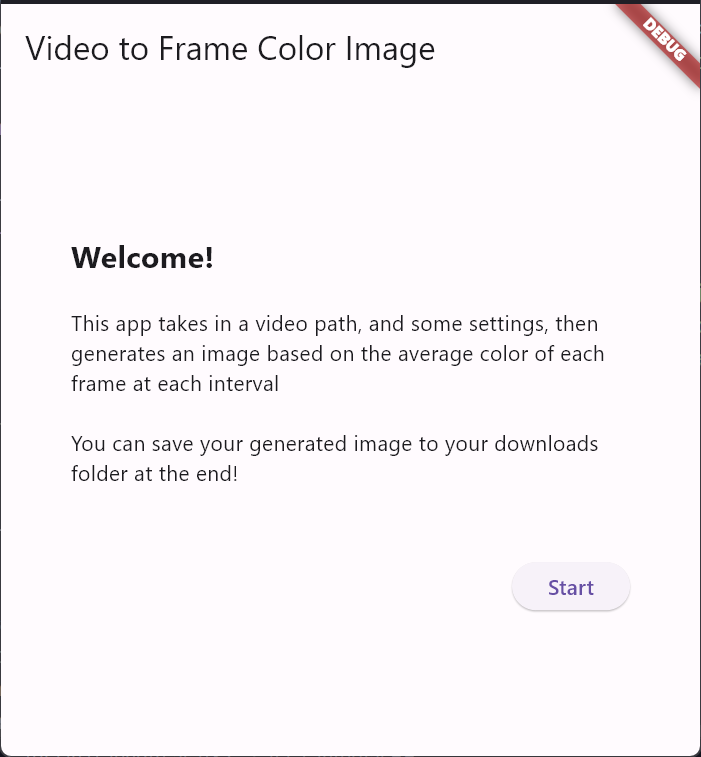
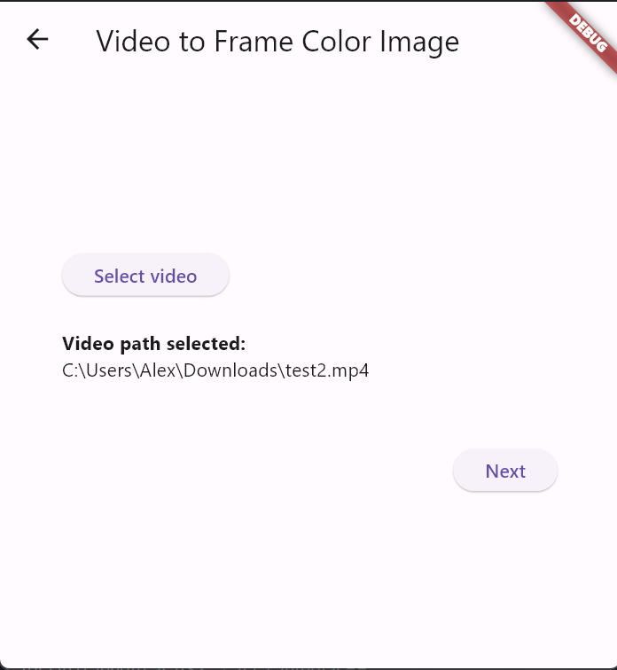
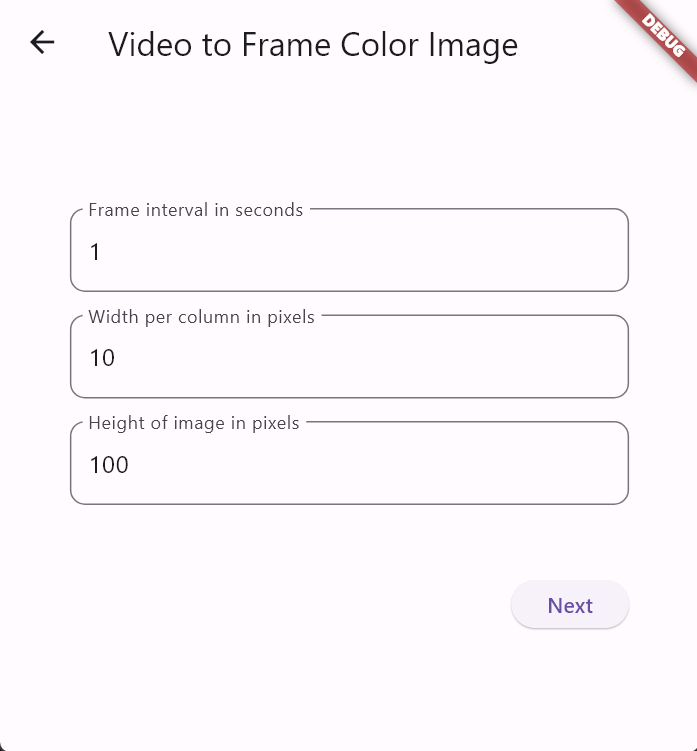
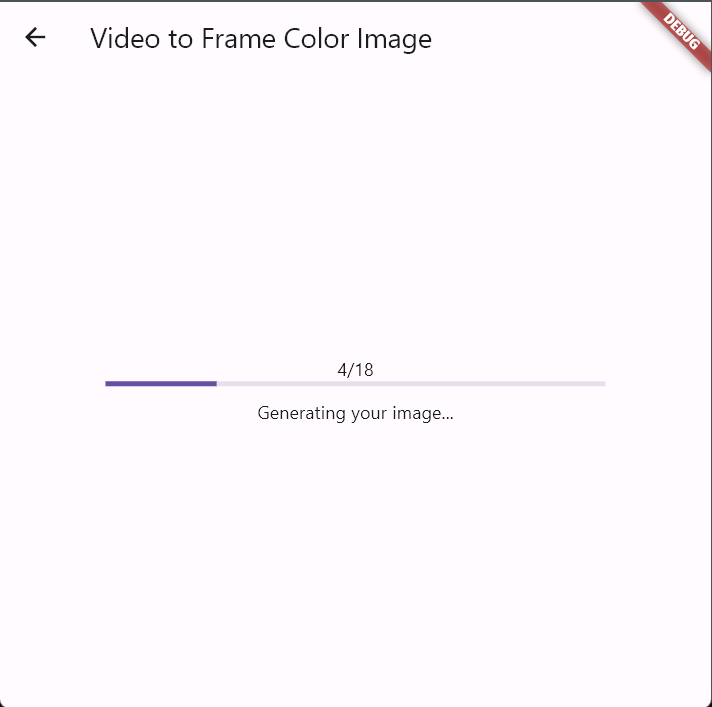
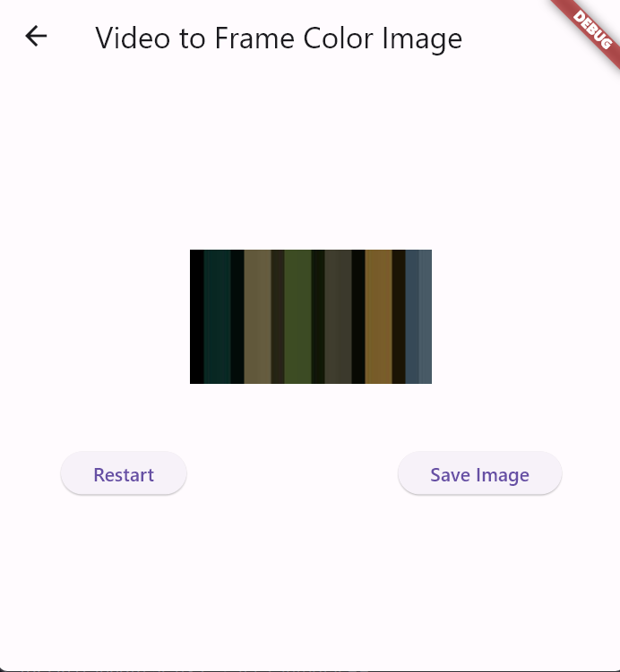
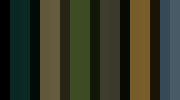

# video_to_frame_average_color_image

Using Flutter and Rust to convert a video to an image made up of 
columns of the average color of each interval frame.

The image processing is largely done in Rust (using ffmpeg), and Flutter 
is only used for user interaction as an alternative to generating through
the terminal.

This project uses the [flutter_rust_bridge](https://github.com/fzyzcjy/flutter_rust_bridge) 
package.

**Note:** I have only tested this on short videos (less than 1 minute).
Nonetheless, it should be able to handle longer videos as it deals with one frame
at a time.

## Getting Started

1. `ffmpeg` and `ffmprobe` are required for this, so they will need to be installed first
   1. The easiest way to do that is `choco install ffmpeg`
   2. Make sure that `ffmpeg` and `ffmprobe` are in your `PATH` environment variable
2. Install the `flutter_rust_bridge` crate
   1. `cargo install 'flutter_rust_bridge_codegen@^2.0.0-dev.0'`
   2. Check the GitHub repo for the newest version
3. Install necessary packages with `flutter pub get`
4. Now you should be able to run with `flutter run`

### Making Changes

- Any changes made to the Rust code will need to be re-generated with the following
  command:
  - `flutter_rust_bridge_codegen generate`

### IDE Errors

I noticed while developing this using IntelliJ IDEA that it said there were many errors,
particularly with the converted Rust code. These errors aren't "real" and everything runs
as it should even with these. It does make finding issues a little more tricky, though.

## Screenshots

- Here's an example going through the app to generate an image from a 19 second video:
 

 

- In this example, the result image generated is:  

## Why did I make this?

For fun, of course!

I remember a few years back I saw a photo on social media of an image
made of a column of the average colors from frames of a movie and I
finally decided to try and re-create it!
